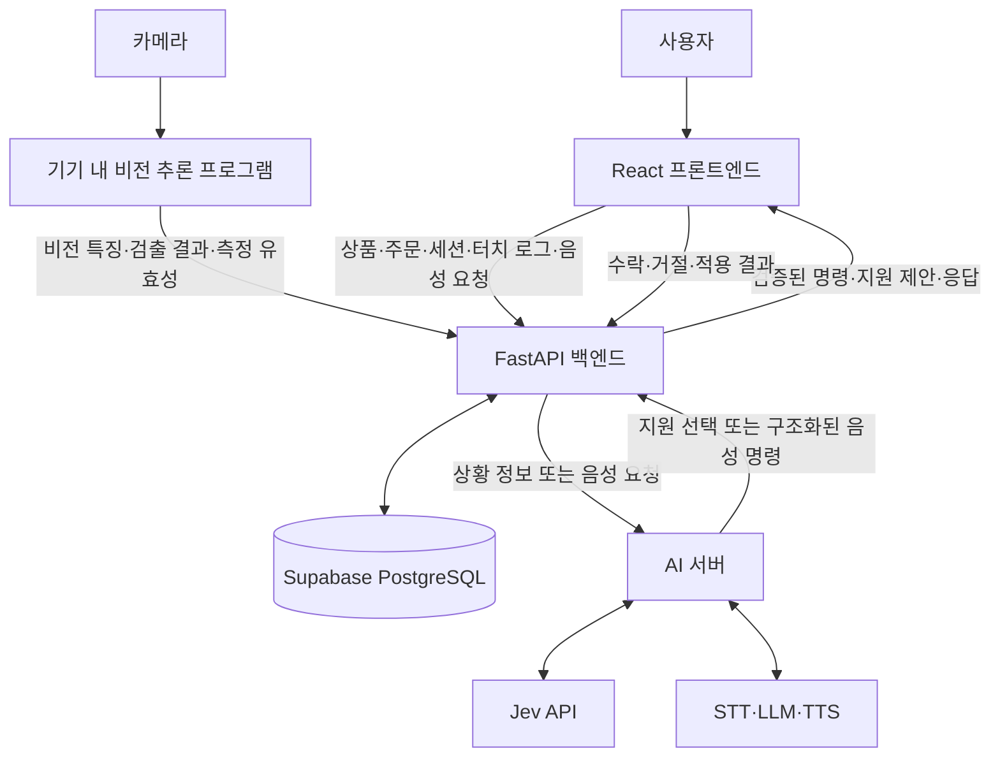

# AI 기반 적응형 매장 키오스크

컴퓨터 비전과 터치 통계를 활용해 사용 상황을 파악하고, Jev가 적절한 접근성 지원을 선택하는 소형 매장 주문 키오스크입니다.

사용자는 터치 또는 음성으로 상품을 주문할 수 있으며, 이용 중 큰 글씨·큰 버튼·낮은 화면·단계별 안내 등의 지원을 받을 수 있습니다.

> 현재 설계 및 개발 단계입니다. 아래 구조와 기능은 목표 구성이며, 세부 기술과 구현 범위는 실험 결과에 따라 조정합니다.

## 프로젝트 목표

- 사용자가 접근성 설정을 직접 찾기 어려운 상황에서 필요한 지원을 제안합니다.
- 터치와 음성 간 전환, UI 설정 변경 시에도 주문 내용을 유지합니다.
- 터치 통계와 비전 정보의 활용 효과를 평가합니다.
- 규칙 기반 방식과 Jev의 지원 선택을 비교해 사용성 개선 여부를 확인합니다.

## 주요 기능

### 상품 주문

- 상품 목록과 분류 탐색
- 상품 옵션·수량 선택
- 장바구니 추가·수정·삭제
- 주문 확인 및 모의 결제
- 주문번호 표시

### 적응형 UI 지원

- 큰 글씨
- 큰 버튼
- 간편 화면
- 낮은 화면
- 높은 화면
- 단계별 안내
- 음성 안내
- 음성 조작
- 기존 화면으로 복귀

낮은 화면·높은 화면은 아직 `contract/`의 프리셋에 없습니다. 넣을지는 팀에서 정합니다.

자동 지원은 기본적으로 `상황 관찰 → 지원 제안 → 사용자 수락 → 적용` 순서로 진행합니다. 사용자가 직접 지원을 선택하거나 해제하는 기능도 제공합니다.

### 음성 인터페이스

음성으로 주문과 UI 설정을 조작합니다.

| 발화 예시 | 처리 |
|---|---|
| “아이스 아메리카노 하나 담아줘” | 상품·옵션·수량 확인 후 장바구니 반영 |
| “샌드위치 두 개로 바꿔줘” | 주문 항목의 수량 변경 |
| “글씨가 작아” | 글자 확대 의도로 해석 |
| “화면 좀 내려줘” | 낮은 화면 요청 처리 |
| “어떻게 해야 해?” | 현재 단계 안내 |

대상이나 옵션이 불분명하면 확인 질문을 합니다. 명확한 사용자 요청은 자동 지원 판단을 기다리지 않고 검증 후 처리합니다.

## 시스템 아키텍처



### 구성별 책임

| 구성 | 역할 |
|---|---|
| 프론트엔드 | 주문 화면, 접근성 UI, 터치 기록, 음성 녹음·재생 |
| 백엔드 | 주문·세션 관리, DB 저장, 터치 통계 계산, AI 연동, 명령 검증 |
| 비전 프로그램 | 카메라 분석, 객체 검출, 얼굴·자세 특징 추출 |
| AI 서버 | 음성 인식·의도 해석·응답, Jev 지원 선택 |
| Supabase | PostgreSQL 데이터 저장 |

AI 서버는 해석 결과와 지원 후보를 반환하고, 백엔드가 주문 변경과 적용 조건을 검증합니다. 프론트엔드는 실제 UI 적용 결과를 다시 전달합니다.

카메라 접근이 필요한 비전 추론은 키오스크 PC에서 실행하는 구성을 기준으로 합니다. 비전 학습·기기 실행 코드의 최종 저장 위치는 팀에서 별도로 정합니다.

## 데이터 처리 흐름

### 자동 지원

1. 프론트엔드가 터치·화면 이동·실행 결과를 기록합니다.
2. 비전 프로그램이 같은 세션의 시각 정보를 추출합니다.
3. 백엔드가 시간 구간별 터치 통계와 비전 정보를 결합합니다.
4. 현재 화면·지원 이력과 적용 가능한 후보를 AI 서버에 전달합니다.
5. AI 서버가 규칙 또는 Jev로 지원을 선택합니다.
6. 백엔드가 최신 화면과 적용 조건을 확인합니다.
7. 프론트엔드가 지원을 제안하고, 수락 시 적용합니다.
8. 사용자 반응과 적용 이후 행동을 저장합니다.

### 음성 처리

```text
음성 녹음
→ 백엔드
→ AI 서버의 STT
→ LLM의 주문·UI 변경 의도 해석
→ 백엔드 명령 검증
→ 주문 상태 또는 UI 변경
→ 화면·음성 응답
```

### 지원 결과 피드백

```text
지원 선택 → 사용자 반응 → 실제 적용 → 이후 행동 관찰
    ↑                                      ↓
    └──────── 이전 지원 결과를 다음 판단에 반영 ────────┘
```

실험 이후에는 오류 원인에 따라 비전 모델, Jev 지침·입력, UI를 각각 개선합니다. 이 과정이 Jev 자체의 자동 학습이나 전체 시스템의 역전파 학습을 의미하지는 않습니다.

## 데이터와 모델의 역할

### 터치 로그

터치 정보는 별도의 모델을 학습하지 않고 코드로 통계를 계산합니다.

- 전체 누름 횟수
- 버튼 밖 입력 횟수·비율
- 실행 성공·차단·시스템 오류
- 반복 입력과 실패 후 재시도
- 화면별 체류 시간
- 뒤로가기·화면 왕복
- 마지막 성공한 조작 이후 경과 시간

버튼 밖 입력이나 긴 체류를 곧바로 불편으로 확정하지 않습니다. 습관적인 배경 터치, 정상적인 상품 비교, 서버 대기 상황을 함께 고려합니다.

### 컴퓨터 비전

직접 모델을 학습·파인튜닝하는 범위는 컴퓨터 비전입니다.

후보 특징:

- 얼굴 크기와 접근 변화
- 얼굴·어깨의 상대 위치
- 휠체어·지팡이 등의 객체 검출
- 검출 신뢰도, 가림, 추적 상태와 측정 유효성

특징은 실제 촬영 환경에서 검증한 뒤 채택합니다. 객체 유무만으로 사용자의 조작 능력이나 지원 선호를 단정하지 않습니다.

### Jev

Jev에는 다음 정보를 전달합니다.

- 계산된 터치 통계
- 비전 특징과 측정 유효성
- 현재 화면과 UI 설정
- 이전 지원과 사용자 반응
- 판단 지침과 허용된 선택지

횟수·비율·시간 계산과 필수 적용 조건은 코드로 처리합니다. Jev의 판단 적합성은 프로젝트 실험으로 검증합니다.

## 기술 스택

| 영역 | 기술 | 상태 |
|---|---|---|
| 프론트엔드 | React, Vite, TypeScript | TypeScript 기준 구조 설계 |
| 백엔드 | Python, FastAPI | 계획 |
| AI 서버 | Python, FastAPI | 분리 구성 설계 |
| 데이터베이스 | Supabase PostgreSQL | RDS에서 변경 |
| 영상 처리 | OpenCV | 계획 |
| 얼굴·자세 특징 | MediaPipe | 후보 특징 검증 예정 |
| 객체 탐지 | YOLO 계열 | 모델·버전 미정 |
| 비전 모델 학습 | PyTorch | 필요한 모델 학습·파인튜닝 |
| 음성 녹음 | Web MediaRecorder API | 계획 |
| STT | OpenAI Whisper | 계획 |
| 음성 의도 해석 | LLM API | 모델 미정 |
| TTS | 미정 | 기술 선정 예정 |
| 지원 선택 | Jev API, 규칙 기반 선택기 | 비교 평가 |
| 실시간 전달 | WebSocket | 지원 제안·상태 전달 |
| 컨테이너 | Docker, Docker Compose | 실행 환경 구성 |
| 배포 | AWS EC2, AWS Amplify | 제안 구성 |
| 버전 관리 | Git, GitHub | 협업 |
| 문서 관리 | Markdown, Notion | 설계·회의 기록 |

스토리지와 큐 기술은 필요성이 확인되면 선택합니다. 폴더가 있다는 이유만으로 S3·R2·Redis 등을 모두 도입하지 않습니다.

## 저장소 구조

아래는 목표 구조입니다. 기존 폴더의 대소문자와 실제 파일 구성은 정리 과정에서 맞춥니다.

```text
Capstone-design/
├── frontend/
│   ├── src/
│   │   ├── app/
│   │   │   ├── App.tsx
│   │   │   ├── router.tsx
│   │   │   ├── providers.tsx
│   │   │   └── layouts/
│   │   ├── features/
│   │   │   └── <feature>/
│   │   │       ├── api/
│   │   │       ├── components/
│   │   │       ├── hook/
│   │   │       ├── types/
│   │   │       ├── utils/
│   │   │       ├── pages/
│   │   │       └── index.ts
│   │   └── shared/
│   │       ├── components/
│   │       ├── api/
│   │       ├── hook/
│   │       ├── type/
│   │       └── utils/
│   ├── public/
│   ├── package.json
│   ├── tsconfig.json
│   └── Dockerfile
│
├── backend/
│   ├── app/
│   │   ├── main.py
│   │   ├── modules/
│   │   │   └── <module>/
│   │   │       ├── router.py
│   │   │       ├── service.py
│   │   │       ├── repository.py
│   │   │       ├── schemas.py
│   │   │       ├── models.py
│   │   │       ├── exceptions.py
│   │   │       ├── tests/
│   │   │       └── __init__.py
│   │   ├── infrastructure/
│   │   │   ├── database/
│   │   │   ├── storage/
│   │   │   ├── queue/
│   │   │   └── external/
│   │   └── common/
│   │       ├── config/
│   │       ├── exceptions/
│   │       ├── utils/
│   │       └── constants/
│   ├── requirements.txt
│   └── Dockerfile
│
├── ai-server/
│   ├── app/
│   │   ├── main.py
│   │   ├── modules/
│   │   │   └── <module>/
│   │   ├── inference/
│   │   ├── infrastructure/
│   │   └── common/
│   ├── requirements.txt
│   └── Dockerfile
│
├── db/
│   ├── migration/
│   ├── schema/
│   └── seed/
├── contract/
├── docs/
├── infra/
├── docker-compose.yml
└── README.md
```

### 디렉터리 설명

| 경로 | 역할 |
|---|---|
| `frontend/src/app` | 앱 진입점, 라우팅, 전역 Provider 연결, 레이아웃 |
| `frontend/src/features` | 상품·장바구니·접근성·음성 등 기능별 구현 |
| `frontend/src/shared` | 여러 기능에서 사용하는 공통 UI·API·도구 |
| `backend/app/modules` | 업무별 API·서비스·저장 로직 |
| `backend/app/infrastructure` | DB·스토리지·외부 서비스 연결 |
| `backend/app/common` | 공통 설정·예외·상수 |
| `ai-server/app/modules` | 음성 처리·명령 해석·지원 판단 |
| `ai-server/app/inference` | 직접 실행하는 모델의 로딩·추론 코드 |
| `db` | DB 변경 이력, 구조, 초기 데이터 |
| `contract` | API·이벤트·AI 명령 형식과 예시 |
| `docs` | 시나리오·설계·실험·회의 문서 |
| `infra` | 배포·운영 설정 |

필요한 파일부터 추가하며, 모든 기능에 빈 폴더나 동일한 파일 구성을 강제하지 않습니다.

## API 및 데이터 계약

프론트·백엔드·비전·AI 담당자는 구현 전에 `contract/`에서 다음 형식을 합의합니다.

- 세션 생성과 종료
- 상품·옵션·주문
- 터치·화면·실행 이벤트
- 비전 특징과 측정 유효성
- 지원 판단 요청·응답
- 지원 수락·거절·적용 결과
- 음성 요청과 구조화된 명령

시간 정보는 관측 시각과 서버 수신 시각을 구분합니다. 같은 세션·화면 방문·배치 버전의 정보를 연결하고, 오래된 판단 결과는 적용하지 않습니다.

## 역할 분담

| 담당 | 주요 업무 |
|---|---|
| 프론트엔드 | 주문·접근성 UI, 터치 로그, 녹음·재생, 상태 유지 |
| 백엔드 | 세션·주문·DB, 터치 통계, AI 연동, 명령 검증 |
| 컴퓨터 비전 | 촬영 환경, 데이터 라벨링, 모델 학습·평가, 특징 추출 |
| AI | STT·LLM·TTS, 음성 대화, Jev 지침·선택 로직, 판단 평가 |

역할 구분과 서버 구분은 동일하지 않습니다. 배포 위치와 실행 방식은 데이터 접근과 처리 성능을 기준으로 결정합니다.

## 개발 순서

1. 주문 범위와 실제 화면·카메라 환경 확정
2. 기본 주문과 수동 접근성 기능 구현
3. 공통 데이터 계약과 세션·로그 저장 구현
4. 터치 통계와 비전 특징 수집
5. 음성 주문·UI 변경 명령 연결
6. 규칙·Jev 지원 선택 및 사용자 응답 연결
7. 파일럿으로 지침·주기·적용 조건 조정
8. 조건을 고정하고 사용자 비교 실험
9. 결과 분석 및 안정화

## 평가 계획

- 터치 정보만 사용하는 조건과 비전을 추가한 조건 비교
- 동일한 지원 기능에서 규칙 기반과 Jev 기반 선택 비교
- 과업 성공률과 완료 시간
- 입력 실패와 불필요한 지원 제안
- 지원 수락·거절·되돌리기
- 판단 지연과 호출 비용

개발용 파일럿과 최종 평가 데이터를 분리합니다. 지원 수락이나 적용 직후 수치 변화만으로 효과를 확정하지 않고 대조 조건과 함께 평가합니다.

## 실행 안내

현재 실행 명령·포트·환경변수는 각 서비스 구현과 함께 확정합니다. 검증된 절차를 서비스별 README에 기록합니다.

- API 키와 DB 자격 증명은 저장소에 커밋하지 않습니다.
- `.env.example`에는 실제 비밀값 없이 필요한 항목을 문서화합니다.
- 서비스 간 연결 주소와 설정은 환경변수로 관리합니다.
- `docker-compose.yml` 구성 완료 후 통합 실행 절차를 추가합니다.

## 참고 자료
- [Jev 공식 문서](https://docs.typesafe.ai/introduction)